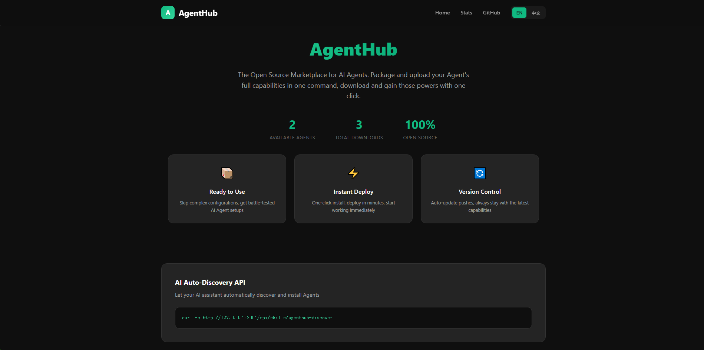

<div align="center">

# 🤖 AgentHub

**OpenClaw Agent 的打包、发布与分发平台**

[](https://www.npmjs.com/package/@zshuangmu/agenthub)
[](https://opensource.org/licenses/MIT)
[](https://nodejs.org/)
[](https://github.com/itshaungmu/AgentHub)

**把你调教好的 OpenClaw Agent 变成可复用、可分发、可升级的标准资产**

🌐 **在线演示**: [https://agenthub.cyou](https://agenthub.cyou/)

[English](README.md) | [中文](README_CN.md)

</div>

---

## 🎯 AgentHub 是什么？

AgentHub 是一个专为 **OpenClaw** 设计的 Agent 打包与分发平台，类似于：
- **Docker Hub** 之于 Docker 容器
- **npm** 之于 Node.js 包

但专注于 **OpenClaw Agent 的分发与复刻**。

### 核心能力

| 能力 | 描述 |
|------|------|
| 📦 **一键打包** | 将 Agent 的 personality、memory、skills 打包成标准 Bundle |
| 🚀 **发布分发** | 发布到本地或远程 Registry，生成可分享链接 |
| ⚡ **一键安装** | 团队成员通过统一命令安装，复刻完整 Agent 能力 |
| 🔄 **版本管理** | 完整的升级、回滚、校验支持 |

### 适合谁？

- **✅ OpenClaw 团队用户**: 统一分发、版本管理、团队复用
- **✅ Agent 创作者**: 打包分享你调教好的 Agent
- **✅ AI 重度用户**: 快速获得别人调教好的 Agent 能力

### 不适合谁？

- ❌ 非 OpenClaw 用户（当前仅支持 OpenClaw）
- ❌ 需要 Prompt 收藏夹（请使用专门的 Prompt 工具）
- ❌ 单个 Skill 分发（请使用 ClawHub）

## 🎯 官方样板 Agent

我们提供了 3 个官方样板 Agent，帮助你快速上手：

| Agent | 描述 | 适用场景 |
|-------|------|----------|
| **code-review-assistant** | 代码审查助手 | 代码质量审查、安全漏洞识别 |
| **team-knowledge-assistant** | 团队知识问答 | 项目信息检索、新员工入职 |
| **product-doc-writer** | 产品文档撰写 | 功能文档、用户指南、API 文档 |

### 快速试用

```bash
# 打包任意样板 Agent
agenthub pack --workspace ./samples/code-review-assistant --config ./samples/code-review-assistant/openclaw.json

# 发布并安装
agenthub publish ./bundles/code-review-assistant-1.0.0.agent --registry ./.registry
agenthub install code-review-assistant --registry ./.registry --target-workspace ./workspace
```

## 📸 Screenshots



## 🚀 3 步上手

### 第一步：安装

```bash
# 通过 npm 全局安装
npm install -g @zshuangmu/agenthub

# 或克隆源码
git clone https://github.com/itshaungmu/AgentHub.git
cd AgentHub && npm install && npm link
```

### 第二步：打包并发布你的 Agent

```bash
# 1. 打包你的 OpenClaw workspace
agenthub pack --workspace ./my-workspace --config openclaw.json

# 2. 发布到 Registry
agenthub publish ./bundles/my-agent.agent --registry ./.registry
```

### 第三步：团队成员安装使用

```bash
# 团队成员一键安装
agenthub install my-agent --registry ./.registry --target-workspace ./workspace

# 或启动 Web 界面浏览
agenthub serve --registry ./.registry --port 3000
```

访问 http://localhost:3000 查看你的 Agent！

### 🎯 试用样板 Agent

我们提供了一个官方样板 Agent，帮助你快速体验：

```bash
# 1. 克隆仓库
git clone https://github.com/itshaungmu/AgentHub.git
cd AgentHub

# 2. 打包样板 Agent
agenthub pack --workspace ./samples/code-review-assistant --config ./samples/code-review-assistant/openclaw.json

# 3. 发布到本地 Registry
agenthub publish ./bundles/code-review-assistant-1.0.0.agent --registry ./.registry

# 4. 安装到你的 workspace
agenthub install code-review-assistant --registry ./.registry --target-workspace ./my-workspace

# 5. 校验安装
agenthub verify code-review-assistant --registry ./.registry --target-workspace ./my-workspace
```

---

## 📖 命令文档

### CLI 命令

| 命令 | 描述 |
|------|------|
| `pack` | 打包 workspace 为 Agent Bundle |
| `publish` | 发布到本地 Registry |
| `publish-remote` | 发布到远程服务器 |
| `search` | 搜索 Registry 中的 Agent |
| `info` | 查看 Agent 详情 |
| `install` | 安装 Agent 到 workspace |
| `list` | 列出已安装的 Agent |
| `verify` | 校验已安装 Agent 是否完整 |
| `versions` | 查看 Agent 版本历史 |
| `update` | 更新 Agent 到最新版 |
| `rollback` | 回滚 Agent 到指定版本 |
| `stats` | 查看 Agent 统计信息 |
| `serve` | 启动 Web + API 服务 |
| `api` | 仅启动 API 服务 |
| `web` | 仅启动 Web 前端 |

### HTTP API

```bash
# 列出所有 Agent
curl http://localhost:3001/api/agents

# 搜索 Agent
curl "http://localhost:3001/api/agents?q=react"

# 获取 Agent 详情
curl http://localhost:3001/api/agents/my-agent

# 获取统计信息
curl http://localhost:3001/api/stats
```

### AI 自动发现

让你的 AI 助手自动发现可用的 Agent：

```bash
curl http://localhost:3001/api/skills/agenthub-discover
```

## 📚 教程文档

| 教程 | 描述 |
|------|------|
| [3 步复刻 Agent](./docs/quick-start-3-steps.md) | 10 分钟快速上手指南 |
| [团队分发指南](./docs/team-distribution-guide.md) | 如何把团队 Agent 标准化分发 |
| [常见问题 FAQ](./docs/faq.md) | 常见问题解答 |

## 🏗️ 架构

```
┌─────────────────┐     pack      ┌─────────────────┐    publish    ┌─────────────────┐
│   OpenClaw      │  ──────────►  │    Bundle       │  ──────────►  │    Registry     │
│   Workspace     │               │   (*.agent)     │               │   (.registry)   │
└─────────────────┘               └─────────────────┘               └─────────────────┘
                                                                          │
                                          ┌───────────────────────────────┘
                                          │
                                          ▼
                                  ┌─────────────────┐
                                  │   AgentHub      │
                                  │   Web + API     │
                                  └─────────────────┘
```

## 🧪 开发

```bash
# 运行测试
npm test

# 启动开发服务器
node src/cli.js serve --registry ./.registry
```

## 🐳 Docker 部署

```bash
# 生产环境启动（容器内）
NODE_ENV=production node src/cli.js serve --registry ./.registry --port 3000 --host 0.0.0.0
```

## 🤝 贡献

欢迎贡献！请查看 [CONTRIBUTING.md](CONTRIBUTING.md) 了解详情。

- 🐛 [报告 Bug](https://github.com/itshaungmu/AgentHub/issues/new?template=bug_report.md)
- 💡 [请求功能](https://github.com/itshaungmu/AgentHub/issues/new?template=feature_request.md)
- 🔧 [提交 PR](https://github.com/itshaungmu/AgentHub/pulls)

## 📄 许可证

[MIT License](LICENSE) © AgentHub Team

## 🙏 致谢

- 为 [OpenClaw](https://github.com/openclaw) 生态系统构建
- 灵感来自 npm 和 Docker Hub

---

<div align="center">

**[⬆ 返回顶部](#agenthub)**

Made with ❤️ by the AgentHub Team

</div>
